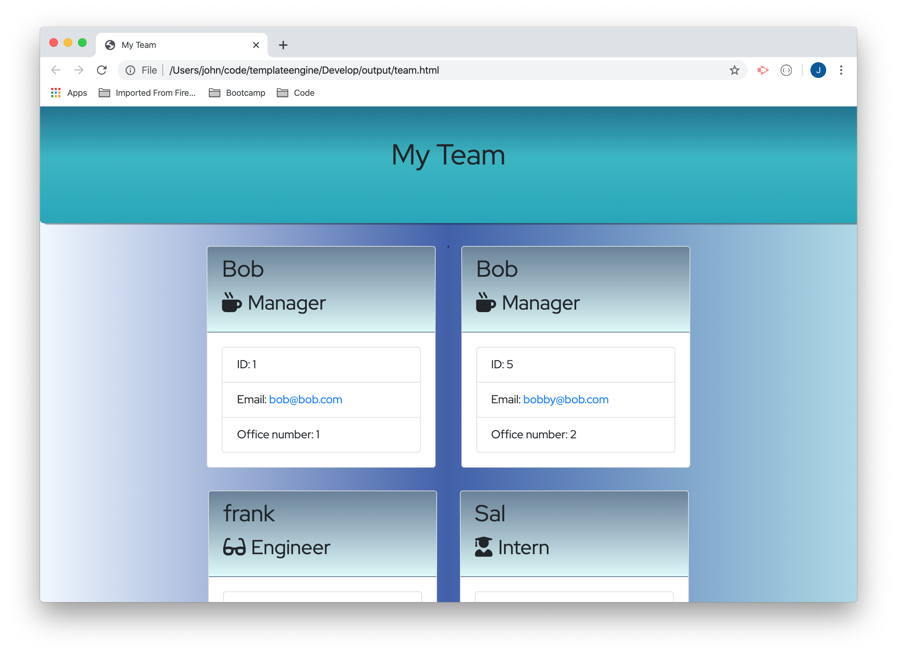

# Template Engine 

    
### Table of Contents
------------------
#### [Description](#Description)    
#### [Installation](#Installation)    

### Description
------------------
An app that takes inputs from the user and outputs an html page. The user can enter as many team members as she likes. Each team member will be added to a card displayed on the generated HTML page.

### Installation
-------------------
This is a CLI app that runs on Node.js. It requires Inquirer and fs.    

##### Email: 
huntsperger@gmail.com

---------------------------
